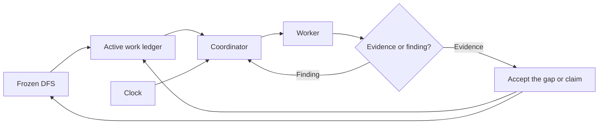
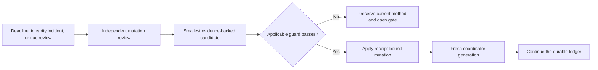
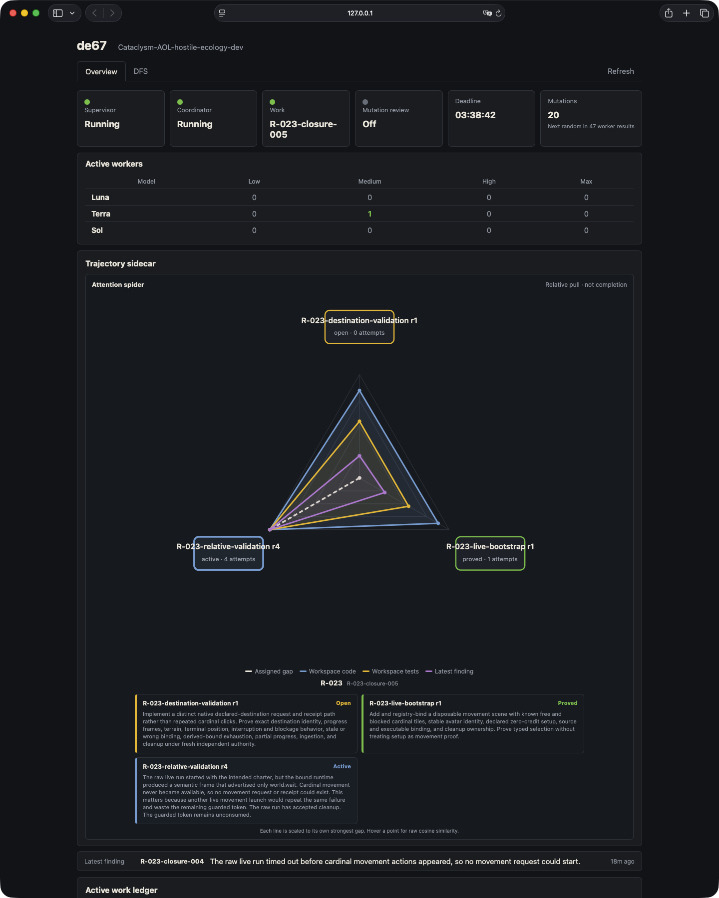

# de67

When software work turns 67—plans multiplying, agents looping, and proof wandering off—de67 acts
like a small coordination enzyme. It recognizes one cut site: work that can be deleted without
leaving the requested outcome unmet or unproved. It preserves the useful strand and permits
mutation only where evidence shows that the method needs editing.

de67 is an OpenAI Codex skill for turning that drift back into a short path from an idea to working,
honestly proven code. It separates discussion, specification, and delivery so each phase receives a
small durable artifact instead of inheriting an expanding conversation.

## Three explicit phases

Invoke the phases as skill commands: `de67 1`, `de67 2`, and `de67 3`.

- **de67 1 — Discuss.** Focused questions turn the user's idea and language into `WEC.md`, without
  prematurely designing the implementation.
- **de67 2 — Specify.** A fresh specification owner inspects the real repository and turns the WEC
  into a frozen, code-grounded `.de67/DFS.md`.
- **de67 3 — Deliver.** Coordinators and workers implement the frozen DFS through deadline-bound
  work, production-route proof, independent failure diagnosis, and controlled mutation.

```text
WEC.md  ->  frozen DFS.md  ->  working, proven code
```

Phases never silently start one another. The user chooses the boundary, and accepted progress
survives coordinator or worker replacement.

## Phase 3 at a glance

Phase 3 keeps implementation work separate from coordination and judges progress through durable
evidence rather than agent confidence.



When evidence contradicts the current route, Phase 3 changes the smallest justified part of the
method without rewriting the user's outcome or erasing failed attempts.



## Lean coordination

de67 is deliberately hostile to coordination theatre. It tries to minimize prompt churn, handovers,
duplicated contracts, speculative documents, repeated tests, and agents reading material they do not
need. Ordinary work mostly uses GPT-5.6 Sol at low reasoning plus Luna and Terra workers selected for
the task. GPT-5.6 Sol at `xhigh` is reserved for ordinary independent mutation review, while the
rare universal mutation uses `ultra`, rather
than routine implementation.

### Role roster

| Role | What it does | Shipped LLM profile |
| --- | --- | --- |
| Phase 1 discussion owner | Clarifies the idea and writes the WEC. | Current Codex agent; no fixed model |
| Phase 2 specification owner | Inspects the repository and freezes the DFS. | GPT-5.6 Sol at `high` |
| Coordinator | Routes the ledger, workers, evidence, and blockers. | GPT-5.6 Sol at `low` |
| Ordinary worker | Implements, investigates, builds, or tests one bounded task. | Luna by default; Terra for difficult diagnosis or risky cross-cutting work; never Terra/`max`; no Sol |
| Deadline, integrity, or random mutator | Independently diagnoses failure and proposes a guarded method change. | Fresh GPT-5.6 Sol at `xhigh` |
| Rare universal mutator | Reviews the whole method after the exact rare trigger. | Fresh GPT-5.6 Sol at `ultra` |

This is the shipped roster, not a claim that every installation needs the same price-performance
choice forever. A user can deliberately use a cheaper roster, such as a Terra coordinator. Make
that change in the writable de67 lab, prove the selected model and effort, and update
the matching guidance, guards, and tests together. A different model changes cost and capability;
it does not expand a role's authority or weaken the evidence required for acceptance.

The clock is deterministic Python, not another language-model agent. It records deadlines, claims,
attempts, evidence, misses, and restart generations without consuming model tokens while it waits.
Mutation is gated and receipt-backed so a failed approach can change without rewriting the user's
goal or erasing accepted work.
Add a proposed behavior correction to `.de67/mutation-suggestions.md` when the next applicable
mutation review should consider it; evidence and guards still decide whether it is applied.

## Shared writing foundations

All three phases use the verbatim [MSW kernel](references/msw-kernel.md) to delete work that the
requested outcome does not need. DE67 also uses one central
[controlled-English guideline](references/controlled-english.md) for owner questions, the WEC, the
DFS, work ledgers, test findings, and blocker messages. The guideline preserves exact technical
identifiers and does not claim formal ASD-STE100 compliance. Compact profiles keep ledger and
OpenClaw writers from loading the full DFS-oriented guideline.

## Requirements

de67 is built specifically for **OpenAI Codex**. It is not an Anthropic or generic multi-agent skill.
It requires:

- the current Codex CLI with subagents and reasoning-effort selection;
- access to GPT-5.6 Sol, GPT-5.6 Luna, and GPT-5.6 Terra, including Sol at `xhigh` and `ultra`;
- Python 3.10 or newer, using only the standard library;
- Git and a repository with an upstream branch for guarded routine checkpoints.

The repository is the complete skill package. Its router, phase instructions, templates, clock,
mutation guards, workspace setup, supervisor, and cross-platform Codex runner are kept together so
an agent can install the `de67` folder into the active Codex skills directory without relying on a
personal machine wrapper.

## Optional integrations

Optional integrations live under `integrations/` and are not core DE67 dependencies. Each package
owns its transport-specific requirements, agent installation guidance, tests, and failure boundary.
Core discussion, specification, supervision, clocks, and delivery must keep working when every
integration is absent or broken.

The OpenClaw Discord blocker adapter is in `integrations/openclaw_discord/`. It can relay one genuine
blocked-only owner question and return one authenticated answer through a generic subprocess
contract. It requires an explicitly configured [OpenClaw](https://docs.openclaw.ai/) installation
and Discord channel; OpenClaw is never imported or required by core DE67.

The read-only dashboard in `integrations/dashboard/` serves live DFS, ledger, clock, mutation, and
process state without coordinator or model calls. It requires only Python. Loopback hosting works
without Tailscale; [Tailscale Serve](https://tailscale.com/kb/1242/tailscale-serve) is the recommended
optional route for authenticated home-network HTTPS. Installing, stopping, or breaking the
dashboard must not affect ordinary DE67 work.



## Release and lab

This repository is the publishable de67 release. Before enabling method mutation, users should
create their own writable Git repository or fork for a `de67-lab` and install the skill from that
checkout. Accepted mutations are checkpointed there, giving the owner a reviewable history and a
safe place to rewind a harmful change. The folder name is not authoritative; the active checkout and
its Git history are. Stable changes can then be promoted deliberately into a public release instead
of turning every live experiment into an upstream change.

Release maintainers must follow `RELEASE_PROMOTION.md`. In particular, promote lab work by merging a
reviewed candidate into the release repository while preserving release history and tags; never
force-push or copy the lab worktree over the release repository.

## Contributions and acknowledgements

- Josef Horvath directed the product, supplied the DE67 method and live CAOL proving ground, and
  made the calls about what was useful versus bureaucracy.
- OpenAI Codex, mostly GPT-5.6 Sol at light reasoning, implemented and integrated the current method,
  optional OpenClaw adapter, dashboard, failure controls, and release packaging—with a suspicious
  willingness to keep going forever.
- [OpenClaw](https://docs.openclaw.ai/) provides the optional owner-messaging route used by the
  Discord blocker adapter.
- [Tailscale](https://tailscale.com/) provides the optional private-network and HTTPS route used by
  the tested Mac-mini dashboard deployment.

- The MSW kernel comes from [@aienginerd on X](https://x.com/aienginerd).
- The imagination round comes from Josef Horvath.
- Phase de67 1's question-driven flow is based on
  [Jekudy's GrillMe skill](https://github.com/Jekudy/grillme-skill).
- Phase de67 1 uses [Simplified Technical English](https://en.wikipedia.org/wiki/Simplified_Technical_English)
  as a practical clarity influence for owner questions. de67 does not claim formal ASD-STE100
  conformance.
- The read-only Phase de67 3 trajectory sidecar was inspired by
  [Slopo's](https://github.com/rafal-qa/slopo) semantic code-similarity approach. de67's independent
  implementation adapts vector proximity to DFS gaps, diffs, tests, and accepted evidence; it does
  not include Slopo code.
- SolAdvisor also influenced de67's advisory approach to agent reasoning and review.

The WEC contract and de67's code-grounded specification, delivery, proof, deadlines, and controlled
method mutation were designed for this skill.

de67 is licensed under [Apache License 2.0](LICENSE).
