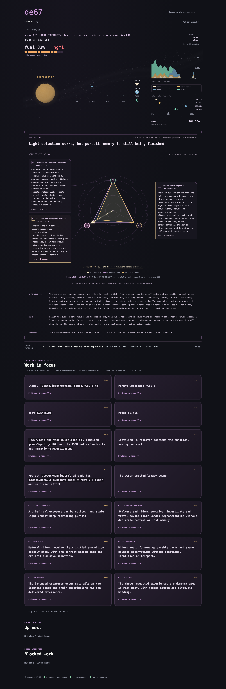

# de67

> Don't let your vibe coding project turn 67. Stop aura farming and start building.
> You need to **de67**.

de67 orchestrates a team of agents in **OpenAI Codex**. Discuss the idea, freeze a specification
grounded in the code, then let **Sol coordinate Terra and Luna workers** to investigate, build,
test, and repair. **Astra steps in at review points to correct the trajectory and improve the
delivery method.**

The coordinator keeps the work moving, the workers do the work, and the ledger carries progress
across handoffs. You set the direction and can steer the run as it goes.

[Get started](#get-started) · [The three phases](#three-phases) ·
[Watch the work](#watch-it-work) · [Steer a run](#steer-phase-3-while-it-runs)

[](integrations/dashboard/README.md)

*Dashboard overview: worker activity, token usage, and the trajectory sidecar.*

## Why de67?

Long agent runs need more than a longer prompt. They need a clear outcome, a record of what
actually happened, and a way to continue when a worker finishes, a process disappears, or the
current approach stops working.

- **Intent stays visible.** Discussion produces a WEC; repository inspection turns it into a
  frozen functional specification. Implementation has something concrete to answer to.
- **Progress has evidence.** Workers return findings and test results. The coordinator decides
  what they establish and what remains unproved.
- **Work survives handoffs.** A SQLite clock and ledger preserve tasks, deadlines, findings,
  and restart generations across coordinator and worker replacement.
- **The method can improve.** An independent mutation reviewer can repair the delivery method
  when evidence or an owner suggestion calls for it.

The aim is working software with inspectable proof. Starting a process, producing a patch, or
passing a compile check is evidence for that particular step—not automatic proof of the outcome.

## Get started

You need the **OpenAI Codex CLI**, **Python 3.10+**, and the model capabilities specified in the
[skill router](SKILL.md#install-or-integrate). Git is needed for repository work.

Install or link the **complete repository** as a folder named `de67` in your Codex skills directory.
Keep the router, phase folders, scripts, references, assets, integrations, and agent metadata
together. Follow the router's [installation checks](SKILL.md#install-or-integrate) before starting.

From the project you want to work on, invoke one phase at a time:

```text
de67 1   discuss the idea
de67 2   inspect the code and freeze the specification
de67 3   build, test, and repair against it
```

**You start each phase explicitly.** Review its durable artifact before moving to the next phase.

## Three phases

| Phase | What happens | What carries forward |
| --- | --- | --- |
| **[1 · Discuss](de-67-1/SKILL.md)** | Focused questions clarify the experience, language, and owner choices. | `WEC.md`: intent, before implementation choices take over. |
| **[2 · Specify](de-67-2/SKILL.md)** | A fresh owner inspects the repository and resolves the functional contract. | Frozen `.de67/DFS.md` and initialized clock state. |
| **[3 · Deliver](de-67-3/SKILL.md)** | A coordinator assigns workers, interprets results, and continues through investigation, implementation, and repair. | Durable findings and evidence for the requested outcome. |

**[See the complete lifecycle and diagrams →](docs/how-de67-works.md)**

## Structure, not a prison

The **supervisor** owns process lifetime. The **coordinator** owns the trajectory.
**Workers** investigate, implement, test, and repair. The clock and ledger preserve what happened
without spending model tokens while nothing is happening.

Independent work can run in parallel. Ordinary failures return to the coordinator as work to
understand and resolve. Accepted progress stays in durable state when an agent is replaced.

When mutation review is due, new dispatch pauses and active workers can finish. A fresh,
independent reviewer examines the method at a quiet junction. Guarded changes and receipts
preserve the handoff, then a fresh coordinator resumes from the ledger.

The machinery gives agents durable structure and leaves semantic judgment with the agents.

## Steer Phase 3 while it runs

Autonomous does not mean unsteerable. Add plain-English guidance to
`.de67/mutation-suggestions.md` at any time:

```text
- Owner-authorized [trigger]: Review this at the next safe worker-quiet junction.
- Owner-authorized [defer]: Keep this for the next regularly due mutation review.
```

**Trigger** makes review due without killing work in flight. **Defer** keeps ordinary delivery
moving and supplies the suggestion to the next scheduled review. Both let you name the outcome
you want the reviewer to address.

The independent reviewer reads the complete ledger, applies owner-authorized changes through the
guarded review route, and returns control to a fresh coordinator.

**[See mutation steering and the review lifecycle →](docs/how-de67-works.md#mutation-without-losing-the-work)**

## Watch it work

The optional dashboard provides a read-only view of the live DFS, work ledger, deadline clock,
coordinator, workers, mutation state, and recent evidence. It cannot control or stop delivery.

Run the dashboard from this checkout:

```sh
python3 integrations/dashboard/de67_dashboard.py --workspace /path/to/project
```

Open `http://127.0.0.1:8767`. The visible tab updates in place every 30 seconds. The dashboard uses Python's standard
library; the optional narrator makes model calls only when configured.

- **[Dashboard guide](integrations/dashboard/README.md):** setup, trajectory sidecar, optional
  narrator, session sources, and network exposure.
- **[OpenClaw owner contact](integrations/openclaw_discord/README.md):** a separate, optional route
  for one human answer when no executable route remains.

## Go deeper

| Looking for… | Start here |
| --- | --- |
| Installation, requirements, and routing | [Skill router](SKILL.md) |
| The complete delivery and mutation lifecycle | [How de67 works](docs/how-de67-works.md) |
| Discussion and the WEC | [de67 1](de-67-1/SKILL.md) |
| Repository inspection and frozen DFS | [de67 2](de-67-2/SKILL.md) |
| Autonomous delivery and mutation | [de67 3](de-67-3/SKILL.md) |
| A manual review of workflow friction | [Alignment audit](alignment-audit/SKILL.md) |
| Minimal-work reasoning | [MSW kernel](references/msw-kernel.md) |
| Clear, auditable artifacts | [Writing guideline](references/controlled-english.md) |
| Live progress website | [Dashboard](integrations/dashboard/README.md) |
| Optional owner contact | [OpenClaw adapter](integrations/openclaw_discord/README.md) |
| Moving tested lab work into a release | [Release promotion](RELEASE_PROMOTION.md) |

## Lab now. Release when proven.

**de67-lab is the active development repository.** This README prepares the next release;
it does not declare stability testing complete.

Local delivery and method mutation do not require a writable method checkout or network access.
A writable lab is useful when you want to generalize and publish an improvement. Stable changes
are promoted deliberately into the release repository, preserving its history and release review.

[The promotion procedure](RELEASE_PROMOTION.md) covers clean-checkout installation, package tests,
optional-integration isolation, and final release approval. Never overwrite the release repository
with a lab worktree.

Built natively for [OpenAI Codex](https://openai.com/codex/). Other agent runtimes would need
equivalent tools, subagents, durable state, and reasoning control; those ports are not shipped.

## Credits

- Josef Horvath directed the product and method, contributed the imagination round, and supplied
  the live Cataclysm-AOL proving ground.
- OpenAI Codex implemented and integrated the current skill, loop, harness, dashboard, integrations,
  and failure controls.
- [OpenClaw](https://docs.openclaw.ai/) provides the optional owner-contact route.
- [Tailscale](https://tailscale.com/) provides the tested private-network and HTTPS route.
- The [MSW kernel](references/msw-kernel.md) comes from
  [@aienginerd](https://x.com/aienginerd).
- Phase 1's question-driven flow was inspired by
  [Jekudy's GrillMe](https://github.com/Jekudy/grillme-skill).
- [Absurd](https://github.com/earendil-works/absurd) by Earendil Works influenced de67's
  database-owned durable workflow state and inspectable agent-loop design. de67's implementation is
  independent and contains no Absurd code.
- The trajectory sidecar was inspired by [Slopo](https://github.com/rafal-qa/slopo). Its
  implementation is independent and contains no Slopo code.
- SolAdvisor influenced the advisory approach to agent reasoning and review.

Licensed under the [Apache License 2.0](LICENSE).
