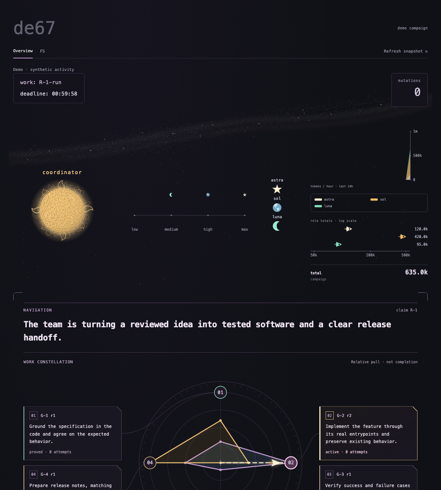

https://github.com/user-attachments/assets/37324dba-d66a-48f1-b628-5e36448b267c

*Illustrated explainer · 2:41. [Download the MP4](docs/assets/de67-explainer.mp4?raw=true).*

# de67

de67 helps a Codex team discuss an idea, freeze a specification grounded in the code, and carry implementation through testing and repair. The work ledger and deadline clock preserve useful evidence and progress across handoffs.

```text
de67 1   plan and discuss the idea
de67 2   inspect the code and freeze the specification
de67 3   orchestrate implementation, testing, and repair
```

[](integrations/dashboard/README.md)

*Synthetic campaign rendered by the release candidate dashboard. The dashboard is optional.*

| Topic | Guide |
| --- | --- |
| Requirements, installation, upgrade, and verification | [Install de67](docs/install.md) |
| Phase commands and boundaries | [Skill router](SKILL.md) |
| Architecture, supervision, and durable artifacts | [How de67 works](docs/how-de67-works.md) |
| Optional dashboard and hosting | [Dashboard guide](integrations/dashboard/README.md) |
| Optional owner contact and direct input | [OpenClaw/Discord guide](integrations/openclaw_discord/SETUP.md) |
| Experimental optional Jev retrieval | [Jev Telescope guide](integrations/jev_telescope/README.md) |
| Experimental optional Jev evidence advisories | [Jev Pit Crew guide](integrations/jev_pit_crew/README.md) |
| Problems and recovery | [Troubleshooting](docs/troubleshooting.md) |
| Release contents and promotion | [3.3.1 release notes](docs/releases/3.3.1.md) and [release promotion](RELEASE_PROMOTION.md) |

The core skill works without optional integrations. Install matching add-on archives only for the capabilities you want; the Jev packages remain experimental and disabled by default.

Built for [OpenAI Codex](https://openai.com/codex/). Josef Horvath directed the method, contributed the imagination round, and supplied the Cataclysm-AOL proving ground. OpenAI Codex implemented the skill and integrations. The [MSW kernel](references/msw-kernel.md) comes from [@aienginerd](https://x.com/aienginerd); [Jekudy's GrillMe](https://github.com/Jekudy/grillme-skill), [Absurd](https://github.com/earendil-works/absurd), [Slopo](https://github.com/rafal-qa/slopo), and SolAdvisor informed parts of the method. Licensed under [Apache 2.0](LICENSE).
