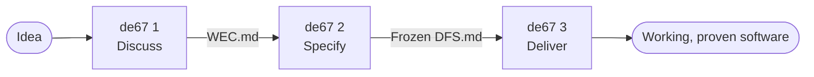
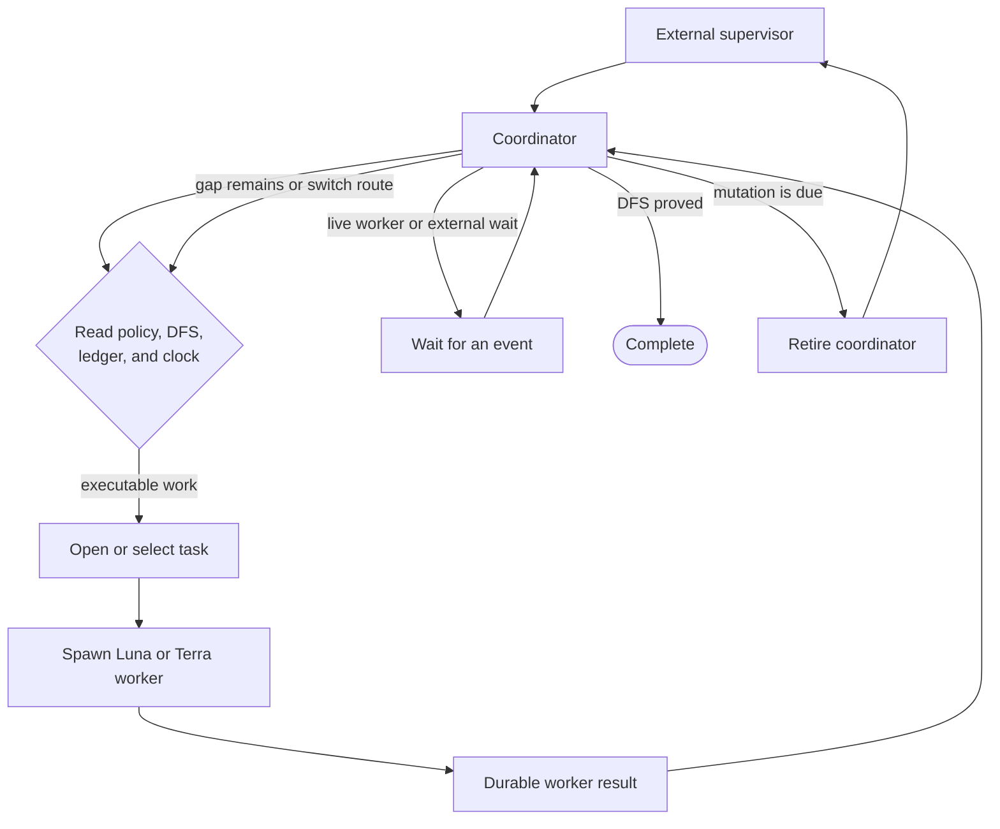
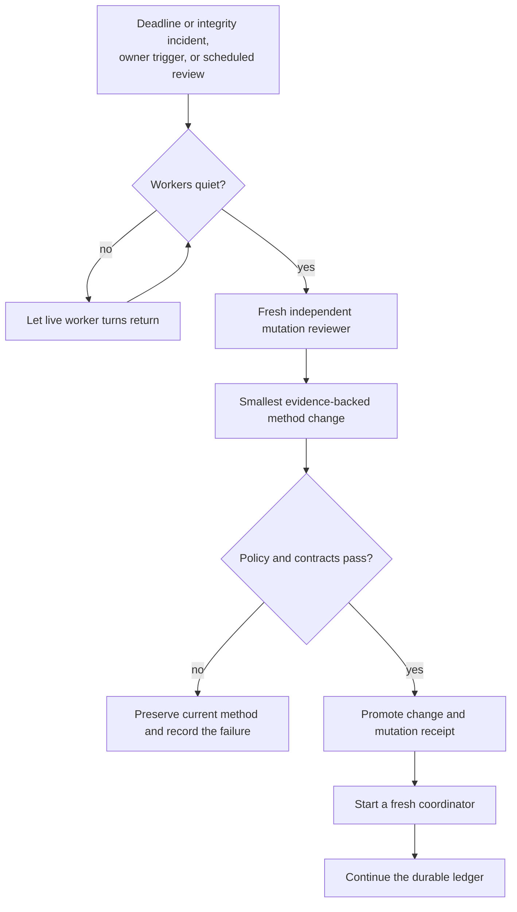

# How de67 works

de67 separates discussion, specification, and autonomous delivery. Each phase receives a small,
durable artifact instead of inheriting an expanding conversation.

## The three phases

The user starts each phase explicitly. Phase 1 preserves intent. Phase 2 grounds that intent in the
repository and freezes the delivery specification. Phase 3 implements and proves the frozen work.

## The de67 3 delivery loop

The external supervisor owns process lifetime. The coordinator owns semantic trajectory. Workers
implement, investigate, test, and repair. SQLite preserves tasks, claims, deadlines, findings,
evidence, and restart generations across process boundaries.

A worker result can be evidence, an ordinary failure, an abandonment, or a formal finding. The same
coordinator receives it and decides what it means. The supervisor checks mechanical possibility; it
does not replace the coordinator's judgment with administrative routing.

Parallel workers are permitted when their work is independent. A due mutation blocks new dispatch,
but already-live worker turns must return and stop editing before review begins. Their tasks can remain
unfinished and resumable after the review.

## Mutation without losing the work

Mutation changes the delivery method, not the requested product outcome. It runs with no coordinator
or worker active and produces a guarded, receipt-backed change before delivery resumes.

`Owner-authorized [trigger]: ...` requests review as soon as workers are quiet.
`Owner-authorized [defer]: ...` queues the same mandatory input for the next regularly due review
without interrupting ordinary delivery.

## Built on Codex

de67 supplies the specification, work ledger, deadline state, policy, and review lifecycle.
The [Codex App Server](https://learn.chatgpt.com/docs/app-server) supplies the native conversations,
turns, tools, and streamed events used by persistent workers and live input. The coordinator can
adapt its approach within this workflow, but de67 is not a runtime-independent orchestration
framework. Moving it to another agent platform would require implementation and new validation.

A returned turn is not a completed task. The coordinator can resume a named worker with its useful
context intact, including under a fresh coordinator after review. Git checkpoints are chosen
snapshots; a failed push is repairable and does not itself stop the delivery loop.

The optional [dashboard](../integrations/dashboard/README.md) reads this state for the owner.
The separately installed [Discord package](../integrations/openclaw_discord/SETUP.md) offers direct
owner input and a distinct blocked-only contact route. Neither is a core prerequisite.
